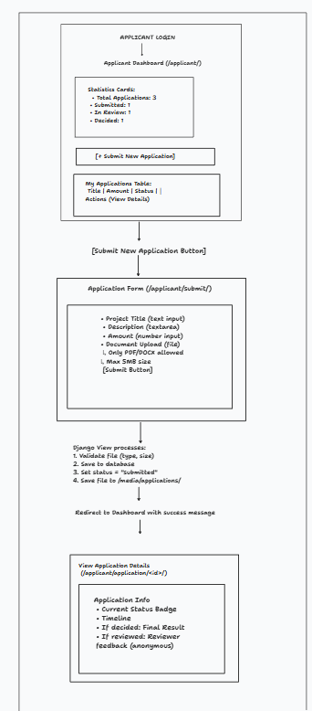

# PHASE 1: REGISTRATION & LOGIN

### Key Implementation:
- **Django Form:** `UserCreationForm` extended with `role` field  
- **View Logic:** User registers → check `user.role` → redirect to Correct Dashboard  
- **Template:** Dropdown with 3 role options (Applicant / Reviewer / Admin)

# PHASE 2: APPLICANT WORKFLOW

## Applicant Workflow

## Django Components Used

### ✔ View  
`applicant_dashboard()`

- Queries: `Application.objects.filter(applicant=request.user)`

### ✔ Template  
`applicant/dashboard.html`

- Renders applications table  
- Uses `` loop

### ✔ Form (ModelForm)  
`ApplicationForm`

- Handles file upload  
- Includes built-in validation

### ✔ View  
`submit_application()`

- Saves form using `form.save(commit=False)`  
- Sets `application.applicant = request.user`  
- Calls `application.save()`

# PHASE 3: ADMIN WORKFLOW

## Django Components

### ✔ View  
`assign_reviewers()`

- Gets all users where `role='reviewer'`

### ✔ Template  
- Displays checkbox list of reviewers

### ✔ Logic  
- Creates multiple `Review` objects in a loop  
- Assigns selected reviewers

### ✔ Status Update  
- Updates `Application.status`  
  - From `"submitted"` → `"in_review"`

# PHASE 4: REVIEWER WORKFLOW (BLINDED REVIEW)

